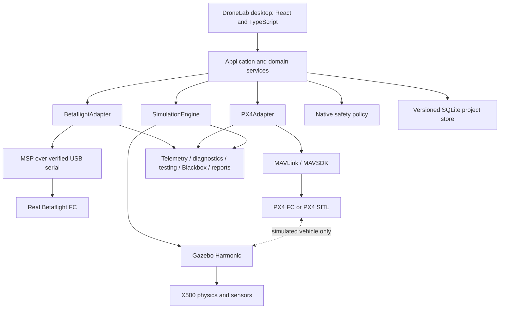

# DroneLab architecture

DroneLab separates presentation, application services, domain models, and device access. Firmware-specific protocol details belong inside adapters. The UI asks for capabilities and presents available operations; it does not send MSP bytes, MAVLink messages, serial commands, or arbitrary native commands.



These are architectural boundaries, not a claim that every adapter or shared module is operational. Phase 0 establishes the desktop and native foundation. Betaflight and PX4 capability descriptions expose unavailable features explicitly. Hardware transports, Blackbox decoding, telemetry plots, and report generation require later verified slices.

The native layer owns filesystem access, SQLite, device access, and safety-sensitive decisions. Frontend state cannot grant native privileges. SQLite migrations preserve existing records and advance a schema version; project data and configuration snapshots are stored independently of UI components. `DroneProject` identifies the intended firmware ecosystem and physical or simulated target. An unavailable adapter must return an explicit error.

Flight-controller adapters and simulation engines are separate contracts. A Betaflight FC need not implement position setpoints or autonomous takeoff. A PX4 FC is not automatically a simulator. The simulation engine controls the world/model lifecycle, while PX4 controls the simulated vehicle. ArduPilot and custom firmware can later register capabilities through the same boundaries.

The retained PX4 subprocess path is:

```text
MAVSDK <-> PX4 SITL <-> Gazebo Harmonic / X500
                |
          uXRCE-DDS client
                |
       Micro XRCE-DDS Agent
                |
       ROS 2 Jazzy / drone_monitor
```

ROS telemetry and the PX4-Gazebo physics link are separate connections. ROS 2 is not a required hop through which PX4 controls Gazebo. The `drone_monitor` subscription requires genuine local-position messages; listing a topic does not prove telemetry. Message definitions must match the selected PX4 firmware. This separation follows the [PX4 ROS 2 architecture](https://docs.px4.io/main/en/ros2/user_guide).

All telemetry should retain timestamp, units, coordinate frame, project, target kind, source identity, firmware, and configuration revision. Shared analysis must not silently combine synthetic fixtures with live hardware or simulator evidence. PX4 NED position uses altitude `-z`; conversion occurs at the adapter/analysis boundary.

Source layout:

| Path | Responsibility |
| --- | --- |
| `apps/desktop/` | React UI and Tauri native application |
| `src/domain/` | Typed projects, capabilities, configuration and safety contracts |
| `src/application/` | Frontend-facing application orchestration |
| `apps/desktop/src-tauri/src/` | Native safety, persistence, errors, adapters and command boundary |
| `config/` | Desktop defaults and separately scoped PX4 settings |
| `scripts/`, `ros2_ws/`, `simulation/` | Retained PX4 subsystem and local validation scripts |
| `tests/` | Isolated unit checks; never production flight evidence |
| `.state/project.json` | Actual DroneLab milestone state |
| `logs/` | Ignored runtime/build evidence |

`.state/phase1.json` remains a historical PX4 checkpoint. New PX4 build checks use `.state/px4-sitl.json` and cannot automatically complete DroneLab Phase 2. See [safety](safety.md) and [phase gates](roadmap.md).
